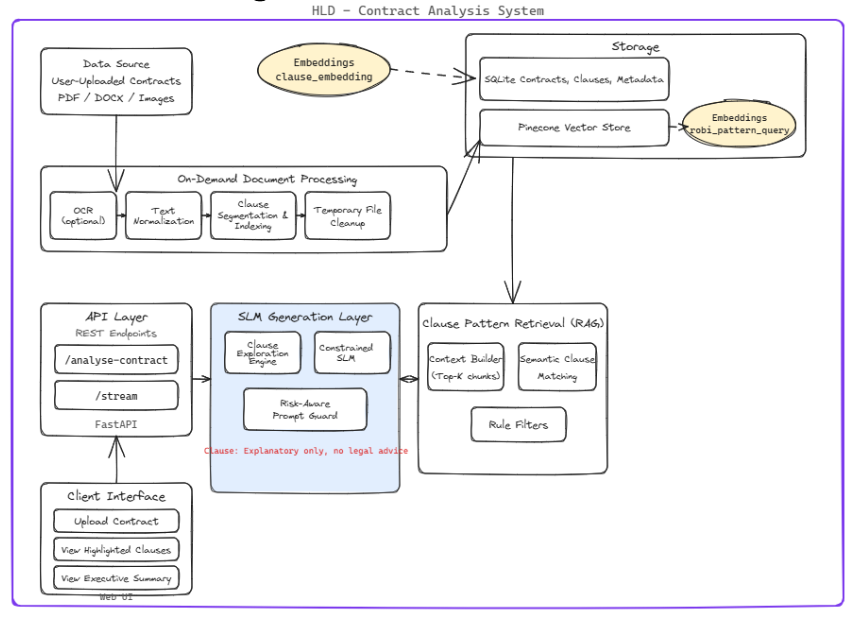
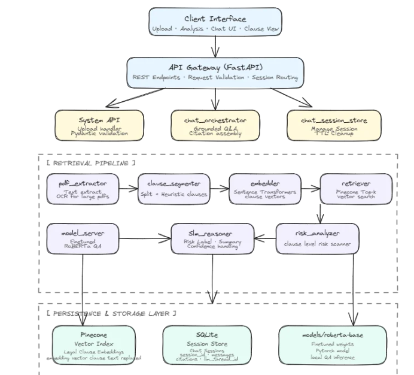
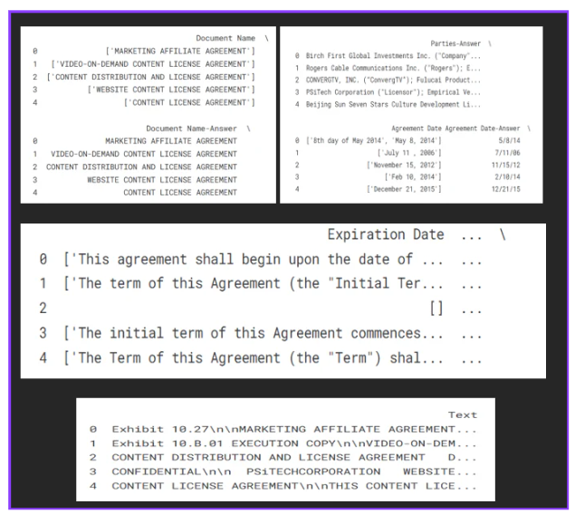
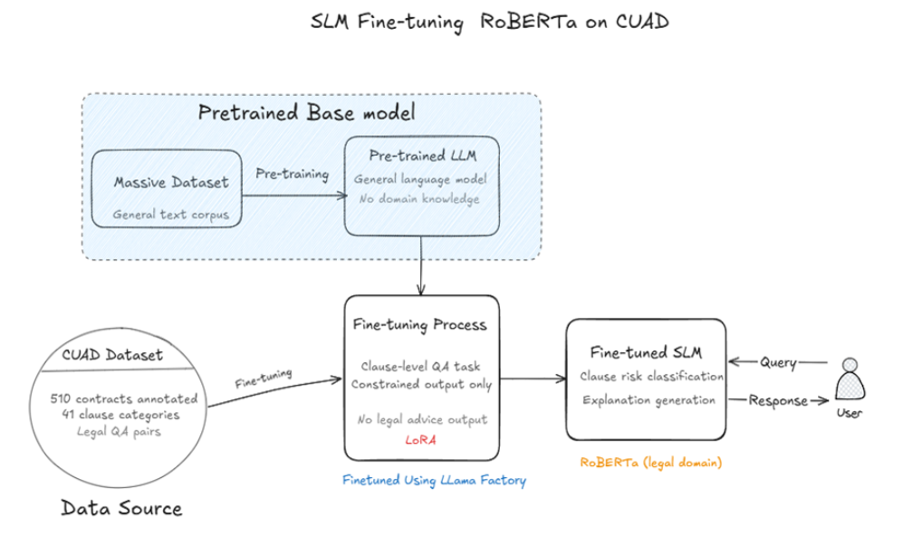

# AI Contract Risk Scanner


## 📋 Problem Statement & Motivation

### The "Signer's Blind Spot"
Traditional Contract Lifecycle Management (CLM) tools are built for enterprises to help them draft and negotiate agreements in their own favor. Individual signers (such as tenants, employees, or small vendors) lack access to affordable, professional legal reviews, leaving them vulnerable to:
*   **Penalty Traps:** Hidden fees, high interest rates, or unexpected costs.
*   **Auto-Renewal Conditions:** Unfavorable long-term commitments that are difficult to cancel.
*   **One-Sided Obligations:** Highly asymmetrical clauses that favor the drafting party.

### Our Solution
The **AI Contract Risk Scanner** reduces **Information Asymmetry** by providing signers with a plain-language explanation of what they are signing, flagging high-risk clauses, and scoring their overall exposure based on their specific role in the agreement.

---

## 🏗️ System Architecture

The system is built on a modular, microservices-inspired architecture consisting of a **React/Vite Frontend**, a **FastAPI Gateway**, a **Document Processing Pipeline**, a **Vector Retrieval Layer**, and a **Fine-Tuned Language Model Inference Layer**.

### High-Level System Architecture


### Service Level Architecture


### 1. Document Processing Pipeline
*   **Native Text Extraction:** The system uses `PyMuPDF` to extract text directly from PDFs.
*   **OCR Fallback:** If a page is scanned or contains low-quality text, it renders the page as a high-resolution image and passes it to `EasyOCR` to ensure no clauses are missed.
*   **Clause Segmentation:** Instead of analyzing the contract as a single block of text, a heuristic segmenter splits the document into individual, meaningful legal clauses for granular analysis.

### 2. Retrieval-Augmented Generation (RAG)
*   **Embedding Generation:** `SentenceTransformers` (`all-mpnet-base-v2`) converts segmented clauses into 768-dimensional dense vectors.
*   **Vector Search:** Clauses are queried against a **Pinecone** index populated with **9,447 unique annotated legal clauses** to find similar historical precedents and risk classifications.

### 3. Model Fine-Tuning (SLM)
*   **Base Model:** `roberta-base` (Hugging Face)
*   **Dataset:** **CUAD** (Contract Understanding Atticus Dataset), containing 510+ commercial contracts and 13,000+ expert-lawyer annotations across 41 legal categories.
*   **Methodology:** Supervised Fine-Tuning (SFT) using **LoRA** (Low-Rank Adaptation) via **LLaMA-Factory** to minimize hallucinations and maximize domain-specific accuracy.





---

## 📊 Performance & Evaluation

### Fine-Tuning Results (CUAD Test Set)
Fine-tuning the Small Language Model (SLM) on domain-specific legal data yielded significant improvements over the base model:

| Model | Accuracy | Precision | Recall | F1-Score |
| :--- | :---: | :---: | :---: | :---: |
| **Pretrained RoBERTa** | 0.56 | 0.50 | 0.48 | 0.50 |
| **Fine-Tuned RoBERTa (SLM)** | **0.72** | **0.77** | **0.76** | **0.65** |

### RAG Integration Value
Integrating RAG with our SLM further boosts accuracy by grounding the model's explanations in the 9,447-clause legal knowledge base:

| Setup | Accuracy (Overall) | F1-Score (Risk Detection) | Explanation Relevance (0-1) |
| :--- | :---: | :---: | :---: |
| **SLM Only** | 0.72 | 0.84 | 0.81 |
| **SLM + RAG** | **0.80** | **0.89** | **0.93** |

*Benefits of RAG: Dramatically reduces LLM hallucinations, increases factual accuracy, and ensures explanation relevance.*

---

## ⚙️ Supported Contracts & Roles

The system supports **12 distinct contract types** and **25+ roles** to deliver tailored, role-aware risk evaluations:

*   **Employment Agreement:** Employer, Employee
*   **Non-Disclosure Agreement (NDA):** Disclosing Party, Receiving Party, Mutual
*   **Service Agreement:** Client, Service Provider
*   **Consulting Agreement:** Client, Consultant
*   **Partnership Agreement:** Partner, Company
*   **Software License Agreement:** Licensor, Licensee
*   **Loan Agreement:** Lender, Borrower
*   **Company Sales Agreement:** Buyer, Seller
*   **Rent Agreement:** Landlord, Tenant
*   **Company Agreement (Bylaws/LLC):** Member, Manager, Company
*   **Merger Agreement:** Acquirer, Target Company, Shareholder
*   **Stakeholder Agreement:** Majority Shareholder, Minority Shareholder, Company Board

---

## 🚀 Quick Start & Installation

### Prerequisites
*   Python 3.8+
*   Node.js (v16+)
*   Pinecone API Key
*   Groq API Key

### 1. Automated Startup (Windows PowerShell)
If you are on Windows, you can start the entire project (backend + frontend) with a single command:
```powershell
.\start_all.ps1
```
*This script will verify your Python environment, install frontend packages, start the FastAPI backend, wait for it to become healthy, and launch the React development server.*

### 2. Manual Installation

#### A. Backend Setup
1. Create a Python virtual environment:
   ```bash
   python -m venv venv
   ```
2. Activate the virtual environment:
   *   **Windows:** `.\venv\Scripts\activate`
   *   **macOS/Linux:** `source venv/bin/activate`
3. Run the setup script to install dependencies and configure files:
   ```bash
   python scripts/setup.py
   ```
4. Create a `.env` file in the root directory and add your keys:
   ```env
   PINECONE_API_KEY=your_pinecone_key_here
   GROQ_API_KEY=your_groq_key_here
   GROQ_MODEL=llama-3.3-70b-versatile
   OCR_ENABLED=true
   ```
5. Run the Ingestion Pipeline (to populate Pinecone with the 9,447-clause dataset):
   ```bash
   python backend/scripts/ingest_pipeline.py
   ```
6. Start the backend API:
   ```bash
   python backend/api.py
   ```
   *The API will be running at `http://localhost:8000` with Swagger docs at `http://localhost:8000/docs`.*

#### B. Frontend Setup
1. Navigate to the frontend directory:
   ```bash
   cd frontend
   ```
2. Install dependencies:
   ```bash
   npm install
   ```
3. Start the development server:
   ```bash
   npm run dev
   ```
   *The web interface will be running at `http://localhost:5173`.*

---

## 🧪 Testing and Verification

### Generate a Sample Contract
You can generate a sample employment contract containing known high-risk clauses (unbalanced termination, broad non-competes) to test the scanner:
```bash
python backend/scripts/create_sample_contract.py
```
This generates `sample_employment_contract.pdf` in the root folder.

### Run System Tests
To verify all integrations (Pinecone connection, Embedding generation, LLM reasoning, Clause segmentation) work properly, run:
```bash
python backend/scripts/test_system.py
```

